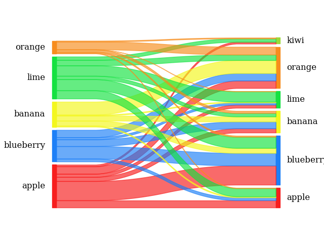

# pySankey

Uses matplotlib to create simple <a href="https://en.wikipedia.org/wiki/Sankey_diagram">
Sankey diagrams</a> flowing only from left to right.

[](https://badge.fury.io/py/pySankeyBeta)
[](https://github.com/Pierre-Sassoulas/pySankey/actions/workflows/ci.yaml)
[](https://coveralls.io/github/Pierre-Sassoulas/pySankey?branch=master)
[](https://github.com/ambv/black)
[](https://www.gnu.org/licenses/gpl-3.0)

## Examples

### Simple expected/predicted example with fruits.txt:

`pysankey` contains a simple expected/predicted dataset called `fruits.txt` which looks
like the following:

<div>
<table border="1" class="dataframe">
  <thead>
    <tr style="text-align: right;">
      <th></th>
      <th>true</th>
      <th>predicted</th>
    </tr>
  </thead>
  <tbody>
    <tr>
      <th>0</th>
      <td>blueberry</td>
      <td>orange</td>
    </tr>
    <tr>
      <th>1</th>
      <td>lime</td>
      <td>orange</td>
    </tr>
    <tr>
      <th>2</th>
      <td>blueberry</td>
      <td>lime</td>
    </tr>
    <tr>
      <th>3</th>
      <td>apple</td>
      <td>orange</td>
    </tr>
    <tr>
      <th>...</th>
      <td>...</td>
      <td>...</td>
    </tr>
    <tr>
      <th>996</th>
      <td>lime</td>
      <td>orange</td>
    </tr>
    <tr>
      <th>997</th>
      <td>blueberry</td>
      <td>orange</td>
    </tr>
    <tr>
      <th>998</th>
      <td>orange</td>
      <td>banana</td>
    </tr>
    <tr>
      <th>999</th>
      <td>apple</td>
      <td>lime</td>
    </tr>
  </tbody>
</table>
<p>1000 rows × 2 columns</p>
</div>

You can generate a sankey's diagram with this code:

```python
import pandas as pd
from pysankey import sankey
import matplotlib.pyplot as plt


df = pd.read_csv(
    'fruits.txt',
    sep=' ',
    names=['true', 'predicted']
)

colorDict = {
    'apple':'#f71b1b',
    'blueberry':'#1b7ef7',
    'banana':'#f3f71b',
    'lime':'#12e23f',
    'orange':'#f78c1b',
    'kiwi':'#9BD937'
}

labels = list(colorDict.keys())
leftLabels = [label for label in labels if label in df['true'].values]
rightLabels = [label for label in labels if label in df['predicted'].values]

# Create the sankey diagram
ax = sankey(
    left=df['true'],
    right=df['predicted'],
    leftLabels=leftLabels,
    rightLabels=rightLabels,
    colorDict=colorDict,
    aspect=20,
    fontsize=12
)

plt.show() # to display
```


### Plotting preprocessed data using weights

However, the data may not always be available in the format mentioned in the previous
example (for instance, if the dataset is too large). In such cases, the weights between
the true and predicted labels can be calculated in advance and used to create the Sankey
diagram. In this example, we will continue working with the data that was loaded in the
previous example:

```python
# Calculate the weights from the fruits dataframe
df = df.groupby(["true", "predicted"]).size().reset_index()
weights = df[0].astype(float)

ax = sankey(
    left=df['true'],
    right=df['predicted'],
    rightWeight=weights,
    leftWeight=weights,
    leftLabels=leftLabels,
    rightLabels=rightLabels,
    colorDict=colorDict,
    aspect=20,
    fontsize=12
)

plt.show() # to display
```



### pysankey function overview

> `sankey(left, right, leftWeight=None, rightWeight=None, colorDict=None, leftLabels=None, rightLabels=None, aspect=4, rightColor=False, fontsize=14, ax=None, color_gradient=False, alphaDict=None)`
>
> **left**, **right** : NumPy array of object labels on the left and right of the
> diagram
>
> **leftWeight**, **rightWeight** : Numpy arrays of the weights each strip
>
> **colorDict** : Dictionary of colors to use for each label
>
> **leftLabels**, **rightLabels** : order of the left and right labels in the diagram
>
> **aspect** : vertical extent of the diagram in units of horizontal extent
>
> **rightColor** : If true, each strip in the diagram will be be colored according to
> its left label
>
> **fontsize** : Fontsize to be used for the labels
>
> **ax** : matplotlib axes to plot on, otherwise uses current axes.

## Important informations

Use of `figureName`, `closePlot`, `figSize` in `sankey()` is deprecated and will be
remove in a future version. This is done so matplotlib is used more transparently as
this [issue](https://github.com/anazalea/pySankey/issues/26#issue-429312025) on the
original github repo suggested.

Now, `sankey` does less of the customization and let the user do it to their liking by
returning a matplotlib `Axes` object, which mean the user also has access to the
`Figure` to customise. Then they can choose what to do with it - showing it, saving it
with much more flexibility.

### Recommended changes to your code

- To save a figure, one can simply do:

```python
  plt.savefig("<figureName>.png", bbox_inches="tight", dpi=150)
```

- The `closePlot` is not needed anymore because without `plt.show()` after `sankey()`,
  no plot is displayed. You can still do `plt.close()` to be sure to not display this
  plot if you display other plots afterwards.

- You can modify the sankey size by changing the one from the matplotlib figure.
  ```python
    plt.gcf().set_size_inches(figSize)
  ```

## Package development

    pip3 install -e ".[test]"

### Lint

    pylint pysankey

### Testing

    python -m unittest

### Coverage

    coverage run -m unittest
    coverage html
    # Open htmlcov/index.html in a navigator
